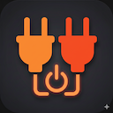

# DualPlug
**DualPlug**はSwitchBot Plug Mini (JP)を使用してデバイスの電源を遠隔操作するアプリケーションです。
2つのプラグを組み合わせた独自のデュアルプラグアーキテクチャにより、3段階の電力制御（オフ/50%/100%）を実現します。

## 機能
### デバイス制御
- 2つのSwitchBot Plug Mini (JP)を組み合わせて3段階の電力制御を実現
  - **オフ (0%)**: 両方のプラグをオフ
  - **半分 (50%)**: プライマリプラグのみオン
  - **最大 (100%)**: 両方のプラグをオン
- 複数のデバイスペアを登録して一括操作が可能

### 天気表示
- 現在地の天気情報をリアルタイムで表示
- Apple WeatherKitを使用した正確な気象データ

### SwitchBot API連携
- SwitchBot API v1.1を使用した安全な通信
- HMAC-SHA256認証による高度なセキュリティ

## 使い方
### 初期設定
1. アプリを起動し、画面右上の歯車アイコンをタップして設定画面を開きます
2. 「SwitchBot API設定」でAPIトークンとシークレットキーを入力します
   - SwitchBotアプリから取得したAPIトークンとシークレットキーが必要です
3. 「デバイス管理」で制御するデバイスペアを登録します
   - 各デバイスペアには、プライマリプラグとセカンダリプラグの2つのSwitchBot Plug Mini (JP)が必要です

### デバイスの操作
- メイン画面に登録したデバイスが一覧表示されます
- 各デバイスカードをタップして電力レベルを切り替えます
  - オフ (0%) → 半分 (50%) → 最大 (100%) → オフ (0%) ...
- 複数のデバイスを個別に制御できます

### 天気情報の表示
- メイン画面上部に現在地の天気情報が表示されます
- 位置情報の使用を許可すると、正確な天気データが取得されます

## 設定
### SwitchBot API設定
- 設定画面から「SwitchBot API設定」を選択します
- 以下の情報を入力します：
  - **APIトークン**: SwitchBotアカウントのAPIトークン
  - **シークレットキー**: SwitchBotアカウントのシークレットキー
- APIトークンとシークレットキーは、SwitchBotアプリの「プロフィール」→「設定」→「アプリバージョン」を10回タップして開発者オプションを有効にした後、取得できます

### デバイス管理
- 設定画面から「デバイス管理」を選択します
- 「新規デバイス追加」をタップして、デバイスペアを登録します
- 各デバイスペアには以下の情報が必要です：
  - デバイス名
  - プライマリプラグのデバイスID
  - セカンダリプラグのデバイスID
- デバイスIDは、SwitchBotアプリまたはSwitchBot APIから取得できます

### 天気情報設定
- 設定画面から位置情報の使用を許可します
- 天気情報の表示/非表示を切り替えられます

## 必要なもの
- iOS 18.5以降を搭載したiPhoneまたはiPad
- SwitchBotアカウント
- SwitchBot Plug Mini (JP) × 2個（デバイスペアごと）
- SwitchBot APIトークンとシークレットキー

## プライバシーポリシー

[Privacy Policy](https://ziotreks.github.io/DualPlugSupport/PrivacyPolicy/)

## コンタクト
Email: support@ziotreks.com

-----
Ziotreks株式会社

Copyright 2026 Ziotreks Ltd.
